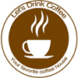

#  Let's Drink Coffee - Website

## 🌐 Overview
This is a simple, responsive coffee shop website with light and dark mode functionality. The project consists of three main sections: a homepage with a hero section, a menu showcasing different coffee options, and a contact form. The site features responsive design for all devices and a toggle button for switching between light and dark mode.


## ✨ Features

- **Responsive Design**: The website is fully responsive, ensuring compatibility with devices of various sizes (mobile, tablet, and desktop).
- **Dark Mode Toggle**: Users can switch between light and dark themes using the "Toggle Dark Mode" button.
- **Smooth Animations**: The site includes subtle animations such as fade-in effects and hover animations on menu items.
- **Simple Contact Form**: Allows users to send their contact details.

---

## 🛠️ Technologies Used
- **HTML5:** For building the structure of the web page.
- **CSS3:** For styling the website, including animations, transitions, and responsiveness.
- **JavaScript:** To handle the dark mode toggle functionality.


## 🚀 How to Use

1. **Clone the repository**:
   ```bash
   git clone https://github.com/hasantohidul/lets-drink-coffee.git
   ```
2. **Open the project:** Open the `index.html` file in a browser to view the website
3. **Toggle Dark Mode:** Click the "Toggle Dark Mode" button in the header to switch between light and dark modes.

## 📂 Project Structure
```
lets-drink-coffee
├─ css
│  └─ styles.css
├─ images
│  ├─ cappucino.jpg
│  ├─ coffee-shop.jpg
│  ├─ espresso.jpg
│  └─ latte.jpg
├─ index.html
├─ js
│  └─ script.js
├─ LICENSE
└─ README.md
```
## 🤝 Contributing
Contributions are welcome! Feel free to fork the repository, make improvements, and submit a pull request.

## 📄 License
This project is Licensed under the MIT License. See the [LICENSE](LICENSE) file for more details.